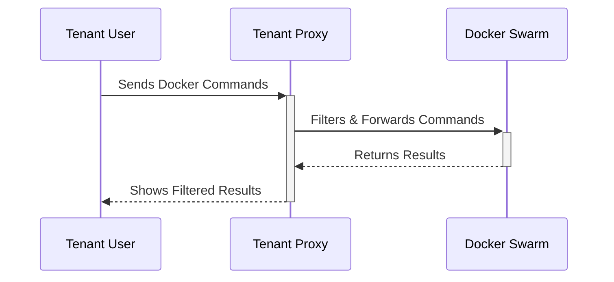

# 🌐 swarmgate - a Docker Swarm Multi-tenant Proxy


## 📋 Project Overview

You might know this issue with docker swarm setups: Either have many people access the same swarm and possibly step on each others feet or have resources underutilized with separate Swarms.

This project aims to alleviate this. We implement a Docker Socket Proxy which is intended to give a tenant specific view onto a Docker Swarm. It exposes all necessary operations to deploy stacks with all features to Docker Swarm as well as management endpoints for volumes, secrets, configs, networks. 

Every proxy can be configured with a unique label to give a tenant specific view onto the swarm. This way you can have multiple teams of people collaborate on the same cluster.
This is done by filtering all requests on resource labels to check whether the resources are "owned" by the proxy/tenant.

This projects uses Node.js and Express for the server, along with the dockerode (and docker-modem) library to interact with Docker.

Note: This is ALPHA software. Please don't use this for separating swarms into tenants and then giving people you can't trust access. In it's current form it is mostly a guard against devs shooting the whole cluster in the foot by accident.
We are working on the security side of things, though. See [this issue](https://github.com/neuroforgede/swarmgate/issues/1) for more information.



## ⭐ Features

- Multi-tenant Access Control: Restricts access to Docker Swarm resources based on ownership labels.
- Environment Variable Configuration: Uses environment variables to control various aspects like allowed volume drivers, volume types, and port exposure.
- Comprehensive API: Provides endpoints for managing Docker services, tasks, networks, secrets, configs, and volumes with ownership checks.
- Baseline Security Checks: Enforces checks on mount types, volume drivers, and ownership of resources like secrets and configs.
- Ability to turn off local volumes.
- Ability to turn off port exposure.

## 🛠️ Prerequisites

- Docker Swarm environment
- Access to Docker socket

## 💾 Installation

To deploy a docker socket proxy, you will first have to generate some certs. As an example, you can look into the `deploy` folder of this repository.

Then, you can deploy the proxy using the following stack file:

```yaml
version: '3.8'

services:
  proxy:
    image: ghcr.io/neuroforgede/swarmgate:0.8.13
    volumes:
      - /var/run/docker.sock:/var/run/docker.sock
    environment:
      - TENANT_NAME=tenant1
      - ALLOWED_REGULAR_VOLUMES_DRIVERS=local
      - ALLOWED_VOLUME_TYPES=bind,volume,tmpfs,npipe,cluster
      - ALLOW_PORT_EXPOSE=true
      - TLS_KEY_FILE=/run/secrets/tls_key
      - TLS_CERT_FILE=/run/secrets/tls_cert
      - TLS_CA_FILE=/run/secrets/tls_ca
      - TLS_DISABLE=false
    user: root
    secrets:
      - tls_key
      - tls_cert
      - tls_ca
    ports:
      - "8080:8080"
    deploy:
      replicas: 1
      placement:
        constraints:
          - node.role == manager

secrets:
  tls_key:
    file: ./server-key.pem
  tls_cert:
    file: ./server-cert.pem
  tls_ca:
    file: ./ca-cert.pem
```

To deploy, run:

```bash
docker stack deploy -c docker-compose.yml proxy
```

To use the proxy, you can then simply use the docker cli. For example:

```bash
TLS_CERT_FILE="$(pwd)/client-cert.pem"
TLS_KEY_FILE="$(pwd)/client-key.pem"
TLS_CA_FILE="$(pwd)/ca-cert.pem"

docker --tls --tlsverify --tlskey "$TLS_KEY_FILE" --tlscert "$TLS_CERT_FILE" --tlscacert "$TLS_CA_FILE"  -H localhost:8080 info
```

Which should just work as with the standard docker engine setup.

Additionally, you should now see logs similar to this in the output of `docker service logs proxy_proxy`:

```
my_proxy_app.1.92wjwd0fz492@ubuntu    | ::ffff:10.0.0.2 - - [12/Nov/2023:18:41:00 +0000] "HEAD /_ping HTTP/1.1" 200 2 "-" "Docker-Client/24.0.5 (linux)" - Client-CN: Client
my_proxy_app.1.92wjwd0fz492@ubuntu    | ::ffff:10.0.0.2 - - [12/Nov/2023:18:41:00 +0000] "GET /v1.43/info HTTP/1.1" 200 3858 "-" "Docker-Client/24.0.5 (linux)" - Client-CN: Client
```

To deploy services, you can simply use the docker cli but make sure all resources are prefixed with the tenant name (e.g. `tenant1` in the following example):

```
docker service create --name tenant1_nginx nginx
```

## 🔧 Environment Variables

- ALLOWED_REGULAR_VOLUMES_DRIVERS: Comma-separated list of allowed volume drivers.
- ALLOWED_VOLUME_TYPES: Comma-separated list of allowed volume types.
- ALLOW_PORT_EXPOSE: Set to 1 or true to allow port exposure.
- TENANT_NAME: Required value for the ownership label.
- SERVICE_ALLOW_LISTED_NETWORKS: Comma-separated list of networks not owned by the proxy that are allowed to be used.
- TLS_KEY_FILE: Path to TLS key file.
- TLS_CERT_FILE: Path to TLS cert file.
- TLS_CERT_FILE: Path to TLS cert file.
- TLS_DISABLE: Set to 1 or true to disable TLS.


## 🤝 How to achieve Multitenancy with this?

The general idea here is to deploy one proxy per tenant. The proxy is then configured with a label that identifies the tenant. All resources deployed by the proxy will be labeled with the tenant label. The proxy will then filter all requests based on the tenant label. This allows for a multi-tenant Docker Swarm environment.

## 🙌 Contributions

Contributions are welcome! Please fork the repository and submit pull requests with your changes. For major changes, please open an issue first to discuss what you would like to change.
